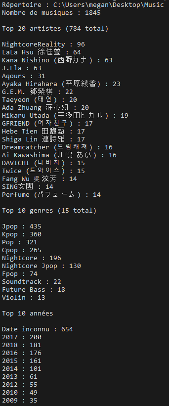
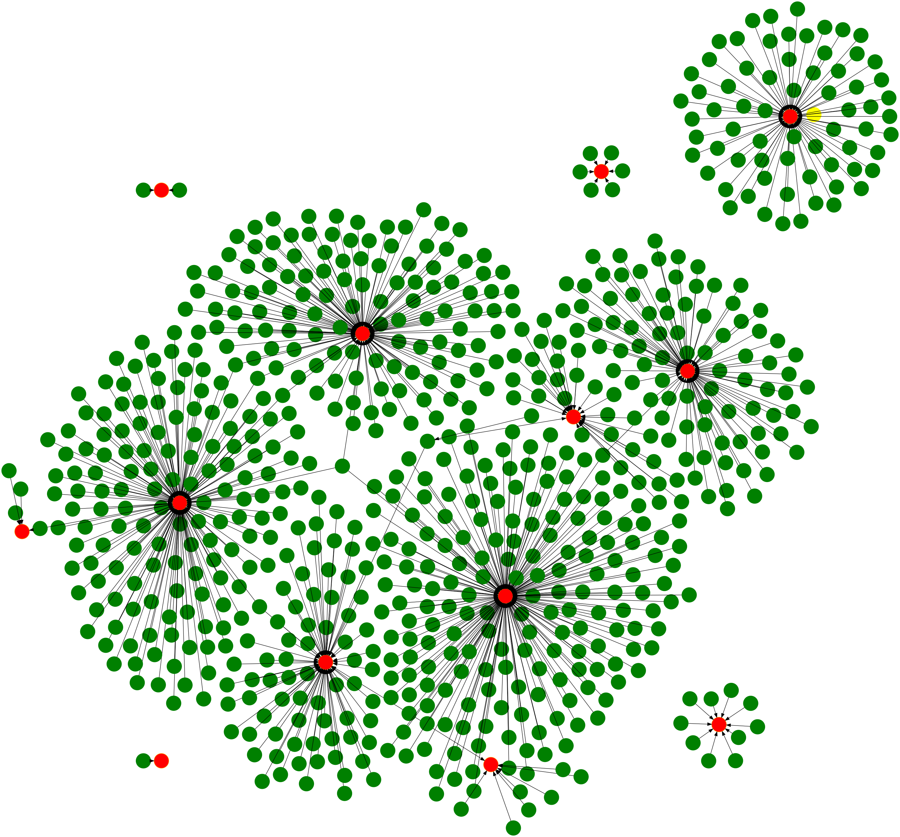

# Playlist Analyser

## Description

Ce logiciel fournit des statistiques à partir des tags des fichiers mp3 ainsi qu'une visualisation de votre playlist musical sous forme de graphiques.

Il utilise les tags ID3 des fichiers MP3 annotés.

## Histoire

Ce projet a été conçu pour me permettre d'avoir des statistiques ainsi que des représentations graphiques à partir d'une importante source de fichiers (+2000) correctement tagué afin de visualiser les données de plusieurs milliers de fichiers mp3.

## Utilisation

Le logiciel contient 3 modes de graphiques ci-dessous expliqué :

- Simple : Affiche uniquement un cercle pour indiquer un genre musical, un artiste ou une musique sans étiquette.

- Détaillé : Affiche un cercle pour un genre musical, un artiste, une musique avec une étiquette à l'intérieur du cercle.

- Pondéré : Affiche un cercle de taille différente suivant le nombre de musiques du genre ou de l'artiste.

```
Playlist_Analyser.exe [PATH] [EXPORT] [TYPE] [GRAPH]

[PATH] : "C:\folder_to_music" : Chemin vers le dossier contenant vos musiques
[EXPORT] : png|svg : Format de visualisation du graphique.
[TYPE] : genre|artist|music : Données affichées sur le graphique.
[GRAPH] : simple|detailled|weighted : Type du graphique.
```

## Exemples

### Statistiques généraux

<p align="center">
	
</p>

### Représentation des artistes

<p align="center">
	
</p>

```
Playlist_Analyser.exe [PATH] png artist simple
```

### Représentation des musiques

<p align="center">
	
</p>

```
Playlist_Analyser.exe [PATH] png music simple
```

### Représentation par poids sans arête

<p align="center">
	
</p>

```
Playlist_Analyser.exe [PATH] png artist weighted
```

### Représentation de playlists massive détaillées

<p align="center">
	
</p>

```
Playlist_Analyser.exe [PATH] png music detailled
```

Voir plus de détails : [ici](Example/)